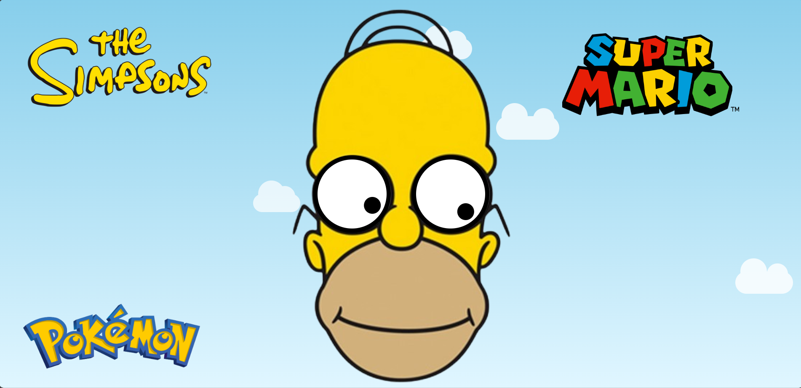

# 👀 Eye Tracker — Fun Characters That Follow Your Mouse

A small and playful **HTML/CSS/JavaScript** project where cute characters' eyes follow your mouse as you move it around the screen!  
This project shows how to create smooth, interactive animations using pure CSS and JavaScript.

---

## 🧠 Features

- 👁️ Eyes smoothly follow the mouse cursor  
- 🧍‍♂️ Multiple characters on the screen  
- 💅 Lightweight and responsive design  
- ⚡ Built with **Vanilla JavaScript** — no frameworks required  
- 🎨 Clean and easy-to-understand code

---

## 🛠️ Technologies Used

- **HTML5** — page structure  
- **CSS3** — styling, positioning, and animations  
- **JavaScript (ES6)** — mouse tracking and eye movement logic

---

## 📂 Project Structure
```
/
├── index.html          # Main page
├── style.css           # Stylesheet
├── background.css      # Background Stylesheet
├── script.js           # Mouse tracking and eye logic
└── assets/             # Images, characters, etc.
```

---

## 🚀 Getting Started

1. **Clone the repository:**
```bash
   git clone https://github.com/homerofsteel/eye-tracker.git
   cd eye-tracker
```

2. **Open the project:**
   Simply open `index.html` in your browser.

✅ **No dependencies or installations required**

---

## 💡 How It Works

Each eye consists of a circular "eyeball" and a smaller "pupil" inside.

When the user moves the mouse, JavaScript calculates the angle between the cursor and the center of the eye, then applies a CSS transformation (`translate()`) to move the pupil in the correct direction — creating the illusion that the eyes are following the cursor.

---

## 🧩 Possible Improvements

- Give each character a unique facial expression
- Add mobile/touch support
- Include sound effects or animations reacting to cursor position

---

## 📸 Preview

*(Add a screenshot of your project here)*



---

## 👨‍💻 Author

Created with ❤️ by HomerOfSteel

Feel free to open an issue or submit a pull request if you'd like to contribute!

---

## 📝 License

This project is licensed under the **MIT License**.

You're free to use, modify, and share it — just keep the attribution.

---